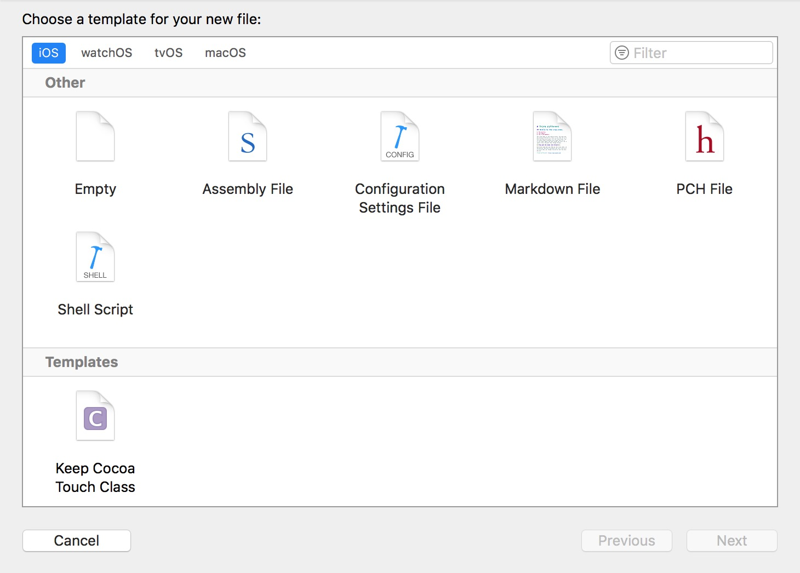

# XcodeTemplate
XcodeTemplate 4 Keep iOS Dev Team

### Usage
Just open your terminator and paste

```
sh -c "$(curl -fsSL https://raw.githubusercontent.com/jackrex/XcodeTemplate/master/install.sh)"

```

Reopen Xcode & You will see



Have Fun !
